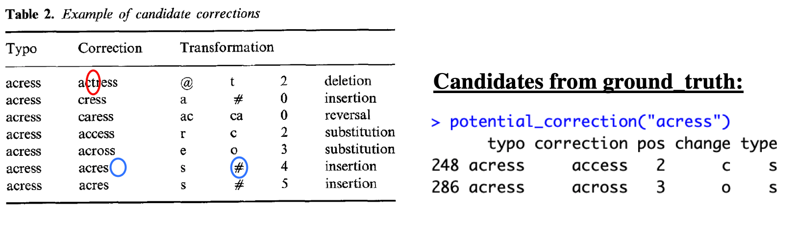
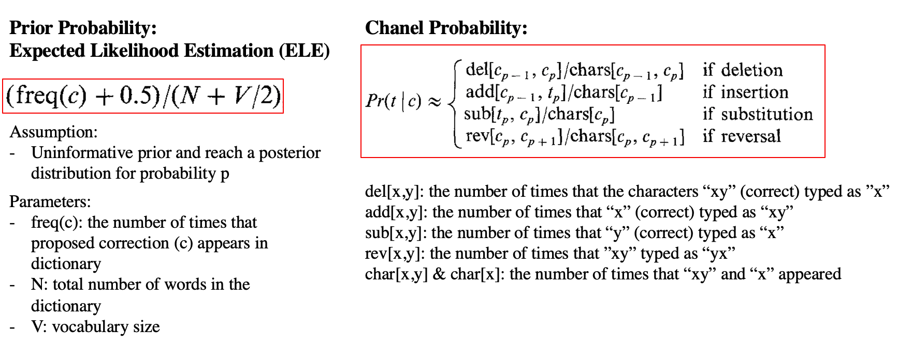
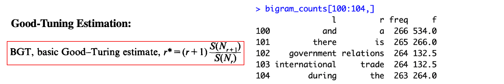
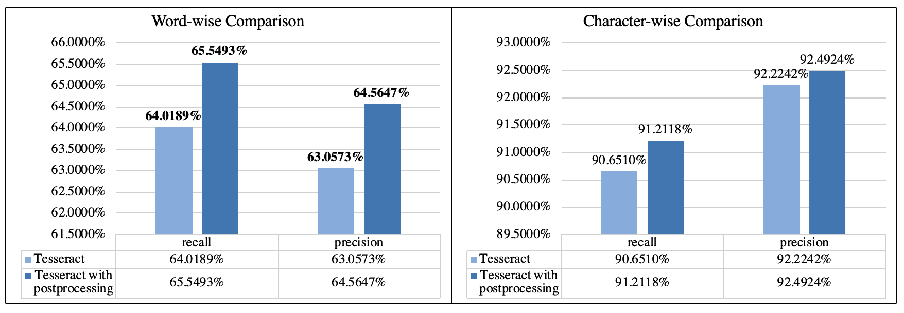

# Project: OCR (Optical Character Recognition) 


### [Full Project Description](doc/project4_desc.md)


Term: Spring 2019

+ Team 12
+ Team members
	+ Li, Xuewei xl2785@columbia.edu
	+ Li, Yuqiao yl3965@columbia.edu
	+ Wang, Jingwen jw3667@columbia.edu
	+ Yang, Zeyu zy2327@columbia.edu

+ Project summary: In this project, we created an OCR post-processing procedure to enhance Tesseract OCR output. We complete the Error Detection process following the paper  [On Retrieving Legal Files:Shortening Documents and Weeding Out Garbage](https://github.com/TZstatsADS/Spring2019-Proj4-grp12/blob/master/doc/paper/D-1.pdf), and the Error Correction process introduced in the paper [Probability Scoring for Spelling Correction ](https://github.com/TZstatsADS/Spring2019-Proj4-grp12/blob/master/doc/paper/C-4.pdf).

+ Presentation: [Group 12 Project 4 Presentation](https://prezi.com/view/tCbWlI59OB0AnvT1E76H/)


**Contribution statement**: ([default](doc/a_note_on_contributions.md)) All team members contributed equally in all stages of this project. All team members approve our work presented in this GitHub repository including this contributions statement. 

+ Li, Xuewei:
+ Li, Yuqiao:
+ Wang, Jingwen:
+ Yang, Zeyu:

---
#### Post-processing Breakdown:

**Error Detection: Rule-based Technique**

<em>Assigned Paper: D1</em>

We identify errors via the following 8 criteria:

1. A string that is more than 20 characters in length

2. If the number of punctuation characters in a string is greater than the number of alphanumeric

3. Ignoring the first and the last characters in a string, the string is identified if it contains two or more different punctuation characters in it

4. If there are three or more identical characters in a row, it’s an error

5. If the number of uppercase characters is greater than the lowercase characters, and if the number of uppercase characters is less than the total number of characters in the string, it is an error

6. When all the characters are alphabetic and the number of consonants in the string is greater than 8 times the number of vowels in the string (vice-versa)

7. Four or more consecutive vowels or five or more consecutive consonants

8. If the first and last characters are both lowercase and any other character is uppercase

**Error Correlation: without context + with context**

<em>Assigned Paper: C4</em>

- **Step 1 Determine Correction Method**: We have four possible correction for each typo: **Insertion**, **Deletion**, **Substitution** and **Reversal**. 

- **Step 2 Generate possible candidates based on `ground_truth`**: use `ground_truth` as the dictionary, for each typo, we generate possible candidates using the previous four correction methods.



- **Step 3 Calculate Pr(c)Pr(t|c)**: P(c) is calculated through `ground_truth` and P(t|c) (typo|correct) is calculated by the word counts in `ground_truth` dictionary and four given confusion matrix in `data`.




- **Step 4 Calculate $Pr(l|c)Pr(r|c)$**: The Section 5 in this paper discusses about how contextual concerns would help to increase the accuracy. Here we use bigram model (i.e. two consecutive words in a line), and we calculate Pr(l|c) and Pr(r|c) using Good-Tuning Estimation.




- **Score: Pr(c) x Pr(t|c) x Pr(l|c) x Pr(r|c)**: previously we extract the position of each typo. After we calculate the score for each (typo,candidate,typo position), we select the correction with the highest score, and we insert this corrected word back to `tesseract_vec`.

#### Algorithm Evaluation:



We measure the algorithm based on word-wise precision, word-wise recall, character-wise precision, and character-wise recall. From the word-wise perspective, the post-processing algorithm helps to increase both recall and precision by approximately 1.5%. From the character-wise perspective, our algorithm increases the recall by 1%, while it only increases the precision by around 0.2%. 

Taking both results from the word-wise level and character-wise level into consideration, we finds that our algorithm works better with `the ground_truth` than with the `OCR output`. It, to some extent, suggests that this algorithm depends on the dictionary that we are using. 

Following [suggestions](http://nicercode.github.io/blog/2013-04-05-projects/) by [RICH FITZJOHN](http://nicercode.github.io/about/#Team) (@richfitz). This folder is orgarnized as follows.

```
proj/
├── lib/
├── data/
├── doc/
├── figs/
└── output/
```

Please see each subfolder for a README file.
